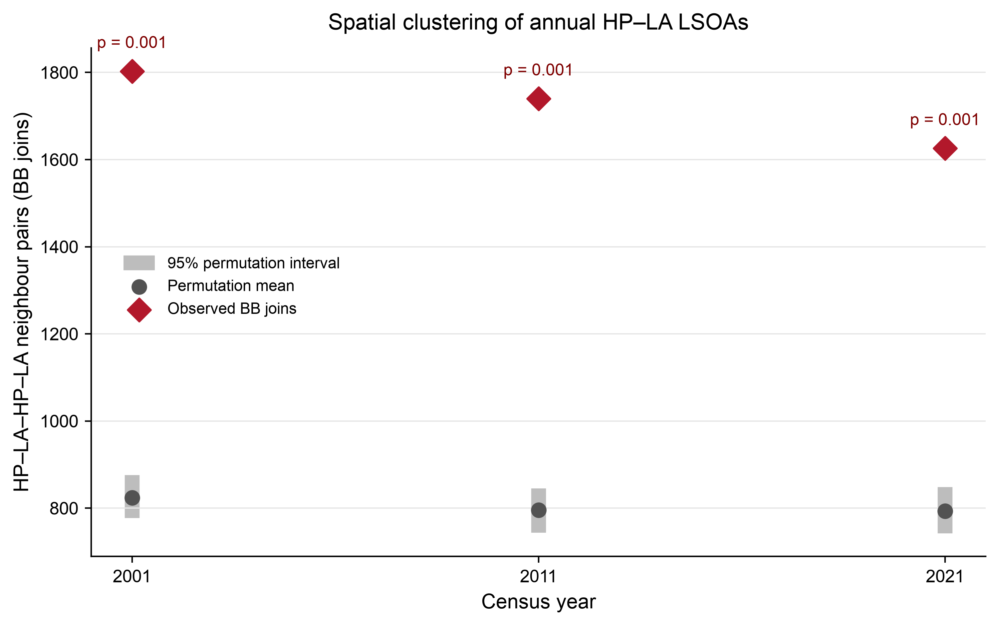

# Travel-Time-Based Registered-Charity Accessibility and High-Intensity Unpaid Care

Reproducibility package for an MSc dissertation examining how potential accessibility to registered care/support charities corresponded with high-intensity unpaid-care pressure across South West England in 2001, 2011 and 2021.

The analytical geography is a fixed set of 3,411 2021 LSOAs. Historical additive Census counts are harmonised to that geography before rates are recalculated. Charity capacity is represented by the LSOA sum of charity-level `log(1 + income_2021_gbp)`. The main accessibility model is a 30-minute road travel-time E2SFCA with exact 20 km external-provider and 40 km external-demand support envelopes.

## Repository status

This repository corresponds to the final dissertation workflow. It contains annotated code, aggregate result tables, non-geographic charts and QA evidence. Raw data, charity-level records, licensed Ordnance Survey data, road graphs, OD caches and LSOA-level analytical outputs are deliberately excluded.

[`release_manifest.csv`](release_manifest.csv) records the size and SHA-256 digest of every packaged file.

The public package does not include Bi-LISA, regression, BYM2 or mismatch-index branches because they are not part of the submitted final analysis.

## Final workflow

1. [`code/01_data_preparation`](code/01_data_preparation) — charity reconstruction, common-2021 harmonisation, boundary support and road preparation.
2. [`code/02_descriptive_mapping`](code/02_descriptive_mapping) — regional, ICB and temporal descriptive summaries.
3. [`code/03_main_travel_time_e2sfca`](code/03_main_travel_time_e2sfca) — main 30-minute travel-time E2SFCA.
4. [`code/04_main_hpla_trajectories`](code/04_main_hpla_trajectories) — annual HP–LA classification, trajectories, ICB and urban–rural decomposition.
5. [`code/05_global_join_count`](code/05_global_join_count) — annual global binary BB join-count tests.
6. [`code/06_distance_sensitivity`](code/06_distance_sensitivity) — 20 km road-distance sensitivity analysis.

Every notebook includes Markdown at the analytical decision points: inputs, frozen definitions, calculation steps, QA hand-offs and interpretation boundaries.

## Verified headline results

- Eligible registered charities: 2,276 (2001), 3,313 (2011) and 3,996 (2021).
- Care50-weighted mean A*: 1.000, 1.213 and 1.244.
- Annual HP–LA LSOAs: 999, 982 and 981.
- Persistent HP–LA trajectory: 571 LSOAs.
- Global BB joins: 1,803, 1,740 and 1,626; all one-sided permutation pseudo-p values were 0.001 using 999 permutations.

The final BB calculation was re-executed from the exact-halo annual HP–LA files on 26 August 2026. The generated table and QA records are in [`results/summary/global_bb`](results/summary/global_bb) and [`results/qa/global_bb`](results/qa/global_bb).



## Reproduce the analysis

Create the environment, point the code to a private copy of the source data and run stages in order:

```bash
conda env create -f environment.yml
conda activate dissertation-accessibility
export DISSERTATION_DATA_ROOT="/path/to/private/dissertation-data"
```

Detailed file placement, execution and verification instructions are in [`REPRODUCIBILITY.md`](REPRODUCIBILITY.md). Data rights and exclusions are documented in [`DATA_AVAILABILITY.md`](DATA_AVAILABILITY.md).
Software and method-source acknowledgements are recorded in [`CODE_PROVENANCE.md`](CODE_PROVENANCE.md).

## Interpretation boundary

Registered/contact addresses and inflation-adjusted income support a measure of potential accessibility and capacity. They do not identify service-delivery locations, observed journeys, individual service use, unmet need or causal effects on unpaid care.

## Citation

Use [`CITATION.cff`](CITATION.cff). The MIT licence applies to original code only; it does not grant rights to any source data or third-party material.
